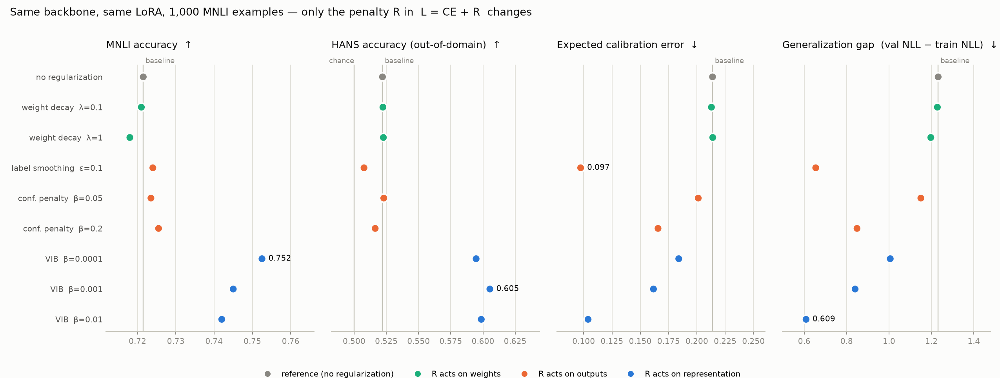
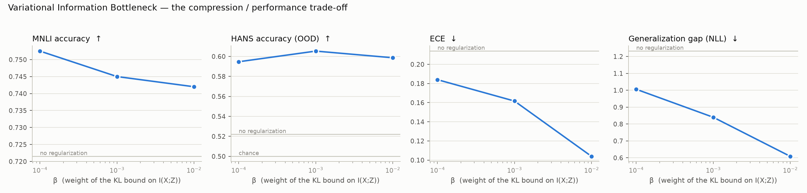
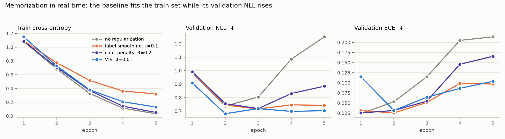
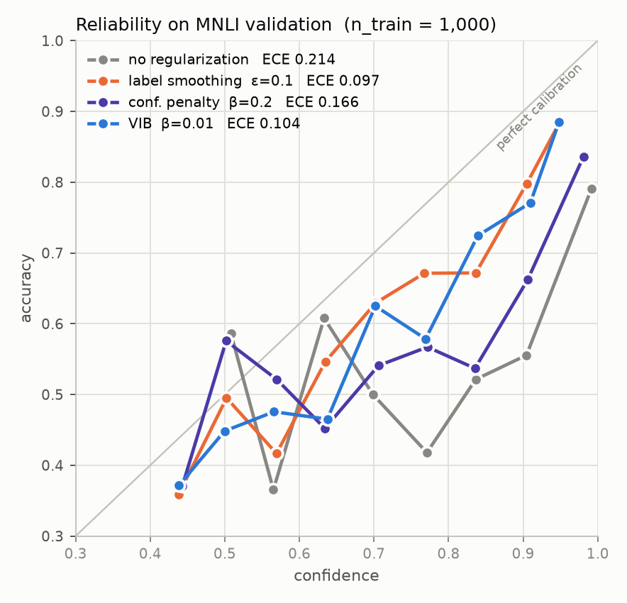
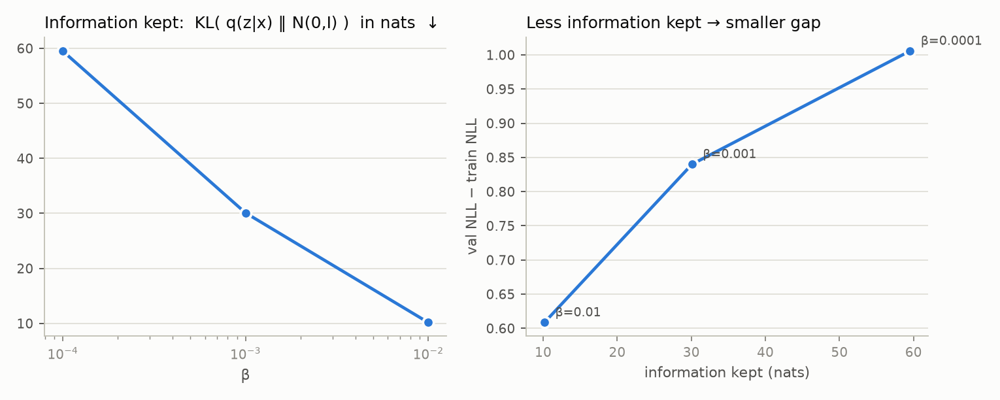

# 🧠 info-reg-bench — Explicit Information Regularization for LLM Fine-Tuning


A small, reproducible benchmark of **information-theoretic regularizers** for fine-tuning a language model
with little data. Same backbone, same LoRA, same 1 000 training examples — the only thing that changes is the
penalty **R** in `L = CE + R`. **Every hyperparameter is tunable from the command line**, and every run fits
on a laptop (Apple Silicon / MPS, CUDA or CPU).

> **The question:** when adapting an LLM with scarce data, is it better to tell it *"keep your weights small"*
> (weight decay) or *"keep only the information that serves the task"* (label smoothing, confidence penalty,
> Variational Information Bottleneck)?

<p align="center">
  
</p>

The theory, with the derivations that connect all these methods to one another, is in
**[docs/THEORY.md](docs/THEORY.md)** (🇫🇷 [docs/THEORIE.md](docs/THEORIE.md)).

---

## 📦 Installation

### Option A — with [`uv`](https://github.com/astral-sh/uv) (recommended)

```bash
git clone https://github.com/rayaneferr/info-reg-bench && cd info-reg-bench
uv run main.py smoke          # creates the env, installs deps, runs a 1-minute end-to-end check
```

> Don't have uv yet? `curl -LsSf https://astral.sh/uv/install.sh | sh` (or `brew install uv`).

### Option B — with plain `pip`

```bash
git clone https://github.com/rayaneferr/info-reg-bench && cd info-reg-bench
python -m venv .venv && source .venv/bin/activate
pip install .
python main.py smoke
```

### Option C — Docker (CPU)

```bash
docker build -t info-reg-bench .
docker run --rm -v $PWD/results:/app/results info-reg-bench smoke --model_name HuggingFaceTB/SmolLM2-135M
```

Datasets (`nyu-mll/glue` · `mnli`, `jhu-cogsci/hans`) and the model (`Qwen/Qwen2.5-0.5B`) are pulled from the
Hugging Face Hub on first run (~1.3 GB, no login). The device is picked automatically (`mps` → `cuda` → `cpu`),
override with `--device`.

| Hardware | One run (n_train = 1 000) | Full grid (8 runs) |
|---|---|---|
| Apple M4 Pro (MPS, fp32) | ~7.5 min | ~1 h |
| CPU only | slow — use `--model_name HuggingFaceTB/SmolLM2-135M --n_train 500` | |

---

## ▶️ Running the benchmark

```bash
# One configuration
uv run main.py run --method none
uv run main.py run --method weight_decay --weight_decay 0.1
uv run main.py run --method label_smoothing --epsilon 0.1
uv run main.py run --method confidence_penalty --beta 0.1
uv run main.py run --method vib --beta 1e-3

# The whole grid (8 configs), skipping finished runs — then the figures
uv run main.py grid --n_train 1000
uv run main.py figures                # -> results/summary.csv, figures/*.png

# More data, more seeds (error bars)
uv run main.py grid --n_train 1000 5000 --seeds 0 1 2
```

Every run writes `results/<run_name>/` with `config.json`, `metrics.json` (final metrics, HANS accuracy per
heuristic, per-epoch history, reliability bins) and the raw validation / HANS logits as `.npz`.

### Parameters

| Flag | Default | Meaning |
|---|---|---|
| `--method` | `none` | `none` · `weight_decay` · `label_smoothing` · `confidence_penalty` · `vib` |
| **`--beta`** | `0` | **strength of `confidence_penalty` / `vib`** |
| **`--epsilon`** | `0` | **label smoothing** |
| **`--weight_decay`** | `0` | **AdamW decoupled weight decay** |
| `--n_train` | `1000` | MNLI training examples (subsampled with `--seed`) |
| `--n_eval` / `--n_hans` | `2000` / `3000` | evaluation subsample sizes |
| `--epochs` / `--lr` / `--batch_size` | `5` / `2e-4` / `16` | optimisation |
| `--model_name` | `Qwen/Qwen2.5-0.5B` | any causal LM on the Hub |
| `--device` | `auto` | `mps` · `cuda` · `cpu` |

Full list with `uv run main.py run --help`.

---

## 📐 What is being compared

Everything is `L = CE + R`. The code for each `R` is a few lines in
[`inforeg/losses.py`](inforeg/losses.py) and [`inforeg/model.py`](inforeg/model.py).

| Method | R | Acts on | Nature |
|---|---|---|---|
| `none` | 0 | — | control |
| `weight_decay` | $\lambda\lVert\theta\rVert^2$ (in AdamW) | weights | explicit, **not** informational |
| `label_smoothing` | CE against $(1-\varepsilon)\,\delta_y + \varepsilon\,u$ | outputs | $\approx \mathrm{KL}(u \,\|\, p)$ |
| `confidence_penalty` | $-\beta\, H(p)$ | outputs | $\mathrm{KL}(p \,\|\, u)$ — Pereyra et al. 2017 |
| `vib` | $\beta\, \mathrm{KL}\big(q(z\mid x)\,\|\,\mathcal N(0,I)\big)$ | hidden representation | bound on $I(X;Z)$ — Alemi et al. 2017, Mahabadi et al. 2021 |

The two output penalties are the same idea with the KL in opposite directions. The VIB inserts a real
stochastic bottleneck `pooled → (μ, log σ²) → z ~ N(μ, σ²) → classifier` between the backbone and the head,
and its KL term is a variational upper bound on the mutual information between input and representation:

$$
\mathcal L_{\text{VIB}} = \mathrm{CE}\big(y,\ f(z)\big) + \beta\ \tfrac12 \sum_j \left(\mu_j^2 + \sigma_j^2 - \log\sigma_j^2 - 1\right)
$$

### Setup

- **Backbone** Qwen2.5-0.5B, fp32, LoRA (r = 16) on `q,k,v,o`, last-token pooling, LayerNorm, head.
- **Train** MNLI (3-way NLI), 1 000 or 5 000 examples.
- **In-domain eval** MNLI validation-matched (2 000 examples).
- **Out-of-domain eval** [HANS](https://arxiv.org/abs/1902.01007) (3 000 examples), 3-way probabilities collapsed
  to entailment / non-entailment. HANS is built so that a model relying on lexical-overlap shortcuts scores at chance.

This is the MNLI → HANS protocol of Mahabadi, Belinkov & Henderson (ICLR 2021), scaled down to a laptop.

### Metrics

| Axis | Metric | Why |
|---|---|---|
| In-domain generalisation | accuracy, NLL on MNLI val | the baseline |
| Out-of-domain generalisation | HANS accuracy, per heuristic | shortcuts are non-predictive information the regularizer should discard |
| Calibration | ECE, reliability diagrams | information penalties act directly on confidence |
| Memorisation | `val_nll − train_nll` | the gap a regularizer is supposed to close |
| Information kept | `KL(q(z\|x) ‖ N(0,I))` of the trained VIB | upper bound on $I(X;Z)$: how much the model keeps of its input |

---

## 📊 Results

Grid at **n_train = 1 000**, one seed, Qwen2.5-0.5B + LoRA, 5 epochs. Full table in
[`results/summary.csv`](results/summary.csv), per-run details in `results/<run>/metrics.json`.

| Method | MNLI acc ↑ | HANS acc ↑ | ECE ↓ | gap NLL ↓ | KL bound (nats) |
|---|---|---|---|---|---|
| none | 0.722 | 0.522 | 0.214 | 1.23 | — |
| weight decay λ=0.1 | 0.721 | 0.522 | 0.213 | 1.23 | — |
| weight decay λ=1 | 0.718 | 0.523 | 0.214 | 1.20 | — |
| label smoothing ε=0.1 | 0.724 | 0.508 | **0.097** | 0.65 | — |
| confidence penalty β=0.05 | 0.724 | 0.523 | 0.201 | 1.15 | — |
| confidence penalty β=0.2 | 0.726 | 0.516 | 0.166 | 0.85 | — |
| VIB β=1e-4 | **0.752** | 0.595 | 0.184 | 1.01 | 59.5 |
| VIB β=1e-3 | 0.745 | **0.605** | 0.162 | 0.84 | 30.1 |
| VIB β=1e-2 | 0.742 | 0.599 | 0.104 | **0.61** | 10.2 |

### What the grid says

**1. Weight decay is inert here.** λ = 0.1 and λ = 1 reproduce the baseline to the third decimal on every
metric. With AdamW's decoupled decay, a learning rate of 2e-4 and ~300 steps, the LoRA weights shrink by a few
percent at most — the constraint on ‖θ‖ never binds. "Keep the weights small" is not a usable lever in the
low-resource LoRA regime.

**2. Output penalties fix the confidence, not the representation.** Label smoothing halves the calibration
error (0.214 → 0.097) and the generalization gap (1.23 → 0.65) at identical accuracy; the confidence penalty
does the same more weakly. But **HANS stays at chance** for both (0.51–0.52): the model still classifies by
lexical overlap, it just reports it less confidently. The KL(u‖p) / KL(p‖u) terms only see the last layer.

**3. The bottleneck is the only method that changes what the model learns.** VIB is the only regularizer
that moves out-of-domain accuracy: **+7 to +8 points on HANS** (0.52 → 0.60), with the gain concentrated on
the *lexical overlap* heuristic (0.575 → 0.710) — exactly the shortcut MNLI teaches. It also gains 2–3 points
in-domain. At β = 1e-2 it additionally matches label smoothing on ECE and has the smallest gap of the grid.

**4. The β sweep is the Information Bottleneck trade-off, made visible.** Raising β by two decades cuts the
information the representation keeps from ~60 to ~10 nats (the KL bound, `val_kl`), and the generalization gap
and ECE fall monotonically with it (`figures/vib_information.png`). The price is one point of in-domain
accuracy (0.752 → 0.742) — the model gives up a little of what fits MNLI to keep only what transfers.

<p align="center">
  
</p>
<p align="center">
  
</p>
<p align="center">
  
  
</p>

### Caveats

- **One seed.** Differences below ~0.5 point (e.g. between the three VIB β on MNLI) are within noise.
  Multi-seed error bars are the next item on the roadmap; `main.py grid --seeds 0 1 2` produces them.
- **One backbone, one training size.** The theory predicts the effect shrinks with more data; the
  n_train = 5 000 grid tests that.
- **HANS is a diagnostic, not a benchmark to win.** 0.60 is still far from robust; the point is the *direction*
  of the change and which family of regularizer produces it.

## ✅ Sanity checks

- `tests/test_losses.py` verifies, on random tensors, the identities the theory relies on:
  confidence penalty $= \mathrm{CE} + \beta\,\mathrm{KL}(p\|u) - \beta\log K$,
  label smoothing $= (1-\varepsilon)\,\mathrm{CE} + \varepsilon\,[\log K + \mathrm{KL}(u\|p)]$,
  the Gaussian KL is 0 at the prior, ECE is 0 for a perfectly calibrated predictor.
- The un-regularised baseline shows the textbook overfitting signature on 1 000 examples: training CE falls
  from 1.08 to 0.03 over 5 epochs while validation NLL *rises* from 0.74 to 1.25 and ECE grows tenfold.
- `uv run main.py smoke` runs the full pipeline (data → LoRA → VIB → metrics) on 64 examples in about a minute.

```bash
make test lint      # or: uv run pytest -q && uv run ruff check .
```

---

## 🗂️ Project layout

```
main.py                 CLI: run · smoke · grid · figures
inforeg/
  config.py             Config dataclass, run naming
  data.py               MNLI (subsampled train, val-matched) + HANS (parquet), pair tokenisation
  model.py              Qwen2.5 + LoRA + LayerNorm + linear or VIB head
  losses.py             the regularizers — one function, one formula per docstring line
  metrics.py            accuracy, NLL, entropy, ECE, reliability bins, MNLI→HANS projection
  train.py              train / eval loop, result writing
scripts/                run_experiment.py · run_grid.py (the GRID) · make_figures.py
tests/                  unit tests, no model download
docs/                   THEORY.md (🇬🇧) · THEORIE.md (🇫🇷)
results/                one folder per run (logits git-ignored, metrics.json kept)
figures/                generated PNGs (overview, β sweep, information, reliability, dynamics)
```

## 🗺️ Roadmap

- [x] V1 — 5 methods (9 configs), MNLI → HANS, accuracy / ECE / gap / KL bound, n_train = 1 000
- [ ] n_train = 5 000 and 3 seeds (error bars)
- [ ] **UID** regularizer (Wei, Meister & Cotterell 2021) on a generation task
- [ ] **KL to a reference model** — the RLHF form of information regularization
- [ ] Layer-wise $I(X;Z)$ / $I(Z;Y)$ estimates: the information plane
- [ ] Canary-based memorisation test
- [ ] Receipt field extraction on the public CORD dataset

## 📚 References

Foundations
- Zhang, Bengio, Hardt, Recht, Vinyals. [Understanding deep learning requires rethinking generalization](https://arxiv.org/abs/1611.03530). ICLR 2017.
- Pereyra, Tucker, Chorowski, Kaiser, Hinton. [Regularizing Neural Networks by Penalizing Confident Output Distributions](https://arxiv.org/abs/1701.06548). 2017.
- Alemi, Fischer, Dillon, Murphy. [Deep Variational Information Bottleneck](https://arxiv.org/abs/1612.00410). ICLR 2017.
- Guo, Pleiss, Sun, Weinberger. [On Calibration of Modern Neural Networks](https://arxiv.org/abs/1706.04599). ICML 2017.
- McCoy, Pavlick, Linzen. [Right for the Wrong Reasons: Diagnosing Syntactic Heuristics in NLI](https://arxiv.org/abs/1902.01007). ACL 2019.

Information Bottleneck and language models
- Mahabadi, Belinkov, Henderson. [Variational Information Bottleneck for Effective Low-Resource Fine-Tuning](https://arxiv.org/abs/2106.05469). ICLR 2021 — *this repo's protocol.*
- Wang et al. [InfoBERT](https://arxiv.org/abs/2010.02329). ICLR 2021.
- Wei, Meister, Cotterell. [A Cognitive Regularizer for Language Modeling](https://arxiv.org/abs/2105.07144). ACL 2021.
- [Information Guided Regularization for Fine-tuning Language Models](https://arxiv.org/abs/2406.14005). 2024.

Recent LLM work (2025)
- [Revisiting LLM Reasoning via Information Bottleneck](https://arxiv.org/abs/2507.18391) (IBRO)
- [Breaking Memorization Barriers in LLM Code Fine-Tuning via Information Bottleneck](https://arxiv.org/abs/2510.16022) (IB-FT)
- [Calibrating LLMs with Information-Theoretic Evidential Deep Learning](https://arxiv.org/abs/2502.06351)
- [Exploring Information Processing in LLMs: Insights from Information Bottleneck Theory](https://arxiv.org/abs/2501.00999)
- [Forgetting-MarI: LLM Unlearning via Marginal Information Regularization](https://arxiv.org/abs/2511.11914)

## 📄 License

MIT — see [LICENSE](LICENSE). If you build on this, a citation via [CITATION.cff](CITATION.cff) is appreciated.
